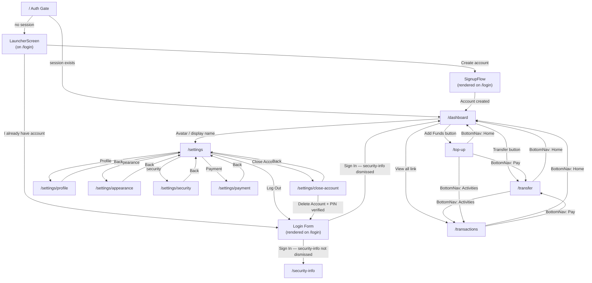
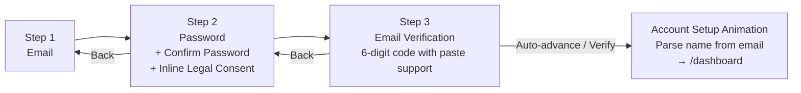

# BeamPay — User Flow & Page Inventory

Developer-facing reference that maps navigation between pages, inventories UI features per page, and documents key user journeys. The app is frontend-only (no backend); all state lives in browser `localStorage`.

---

## Navigation Chrome

Two persistent navigation elements appear across authenticated pages:

### BottomNav (`src/components/BottomNav.tsx`)

Floating pill fixed to the bottom viewport. Present on `/dashboard` and `/transactions`. **Not present** on settings pages (hub or sub-pages) or drawer overlays.

| Tab | Icon | Route | Active when |
|-----|------|-------|-------------|
| Home | House | `/dashboard` | `pathname === "/dashboard"` |
| Pay (center) | ScanLine | `/transfer` | Never highlighted (floating design is visually distinct) |
| Activities | Clock | `/transactions` | `pathname === "/transactions"` |

### PageHeader (`src/components/PageHeader.tsx`)

Shared header component used on all authenticated pages. Three modes:

- **Avatar mode** (no `title` prop): Shows user avatar + display name, links to `/settings`. Used on `/dashboard`. When `showThemeToggle` is passed, renders a moon/sun circle button on the right to toggle light/dark mode.
- **Title + back mode** (`title` + `backHref` props): Shows a back arrow in a rounded circle + page title. Used on settings sub-pages (e.g., `<PageHeader title="Profile" backHref="/settings" />`).
- **Title mode** (`title` prop only): Renders a plain `<h1>` page title. Used on `/transactions` ("Activities"), `/settings` ("Settings").

Avatar shows: uploaded photo (base64), preset SVG (`/avatars/{id}.svg`), or initials fallback.

---

## Navigation Map

---

## SignupFlow Detail

Three-step wizard rendered on `/login` when user clicks "Sign up".

> Note: Name is auto-parsed from email (e.g., `john.doe@gmail.com` → John Doe). PIN and profile picture are deferred — PIN is set on first PIN-gated action via `PinSetupModal`.

---

## Per-Page Feature Inventory

---

### `/`

**Layout:** None
**Auth guard:** This IS the guard — no UI rendered
**Components:** Inline `Home` page component

**UI elements:**
- "Redirecting…" text (muted, centred) shown while `useEffect` resolves

**Actions / outbound:**
- `currentUser` exists → redirect to `/dashboard`
- No `currentUser` → redirect to `/login`

---

### `/login`

**Layout:** None (public page)
**Auth guard:** No
**Components:** `LauncherScreen`, `BalanceCard` (demo mode), Login form (inline), `SignupFlow` (conditional)

Three phases controlled by `LoginPagePhase` state: `"launcher"` (default) → `"login"` or `"signup"`.

**UI elements — Launcher phase (`LauncherScreen`):**
- `BalanceCard` in demo mode (shows demo balance, flips from back to front after 2 s)
- Glowing orb behind card, tagline ("Pay anyone, instantly." — neon gradient text)
- "Create account" primary button → switches to signup phase
- "I already have account" ghost button → switches to login phase

**UI elements — Login phase:**
- "Welcome back" heading
- Email input
- Password input with show/hide toggle
- "Forgot password?" link button — shows info toast, no actual reset
- "Sign In" submit button with loading state ("Signing in…")
- "Don't have an account? Create one" link → switches to signup phase

**UI elements — Signup phase (`SignupFlow`):**
- Step 1: Email input, Continue button, "Already have an account? Log in" link. Validates email format AND checks for duplicate registration.
- Step 2: Password + Confirm Password inputs with strength bar (4-segment: weak/fair/good/strong) + requirements checklist + inline legal consent text below Continue
- Step 3: 6-digit code displayed in a highlighted card; 6 auto-advancing digit inputs with paste support; auto-submit on correct code completion; "Verify Email" button
- Post-verification: "Setting up your account..." full-screen animation → name parsed from email → account created → redirect to /dashboard

**Mocked:**
- Forgot password → `toast.info` only, no email sent
- Email verification code is displayed directly in the UI, no email sent

---

### `/dashboard`

**Layout:** PageHeader (avatar + name, links to `/settings`, theme toggle button) + BottomNav (Home active)
**Auth guard:** Yes → `/login`
**Components:** `PageHeader` (with `showThemeToggle`), `BalanceCard`, `TransactionHistory` (limit=5), `BottomNav`

**UI elements:**
- Header: avatar (44×44 px, links to `/settings`), display name, theme toggle button (moon/sun, 44×44 px circle, top-right)
- `BalanceCard`: 3D tilt card (gyroscope + pointer/touch, `translateZ` for logo/balance pop); primary currency balance + IDR equivalent; always uses light mode lime gradient styling regardless of theme
- Two CTA buttons (2-col grid, `variant="secondary"`): Transfer (ArrowRightLeft icon) → `/transfer`; Add Funds (Plus icon) → `/top-up`. Each uses `onClick` with `router.push()` and haptic feedback.
- Activities section: "Activities" title + "View all" link → `/transactions`; last 5 transactions with coloured avatars, amounts in USD + IDR
- Empty state: "No transactions yet"

---

### `/transfer`

**Layout:** DrawerPage (slide-up overlay, 90vh, slides down on close, no BottomNav). Uses intercepting route (`@drawer/(.)transfer`) — current page stays visible behind backdrop.
**Auth guard:** Yes → `/login`
**Components:** `DrawerPage`, `SendForm`, `PinVerificationModal`

**UI elements:**
- Recipient email input
- Amount input (numeric, min 0.01, max = current balance)
- "Available balance: $X.XX" helper text
- "Send Money" button with loading state ("Sending…")
- `PinVerificationModal` (opens after form validation passes):
  - Title: "Confirm Transaction"; description shows amount + recipient
  - 4 auto-advancing digit inputs
  - 3 attempts allowed; 5-minute lockout after 3 failures with live countdown
  - "Verify" button (disabled until 4 digits entered or during lockout)
  - "Cancel" button

**Actions / outbound:**
- Close button / backdrop tap → `router.back()` (returns to referring page)

**Validation / error states:**
- Amount ≤ 0 → error toast
- Amount > balance → error toast "Insufficient balance"
- Recipient not found → toast error from `WalletContext`
- Wrong PIN (1–2×) → "Incorrect PIN. N attempts remaining."
- Wrong PIN 3× → 5-minute in-memory lockout with countdown

---

### `/top-up`

**Layout:** DrawerPage (slide-up overlay, 90vh, slides down on close, no BottomNav). Uses intercepting route (`@drawer/(.)top-up`) — current page stays visible behind backdrop.
**Auth guard:** Yes → `/login`
**Components:** `DrawerPage`, `TopUpForm`

**UI elements — no saved cards:**
- Amount input (numeric, min 0.01)
- Card Number input (16 digits, numeric)
- Expiry input (auto-formats to MM/YY)
- CVC input (3 digits)
- "Save this card for future use" checkbox
- "Top Up" button with loading state ("Processing…")

**UI elements — with saved cards (additional):**
- "Use a new card" checkbox — toggles between saved card selector and new card form
- Saved card `Select` dropdown: `{label} • Expires {expiry}`

**Actions / outbound:**
- Close button / backdrop tap → `router.back()` (returns to referring page)

**Mocked:**
- 1.5 s `setTimeout` simulates payment processing
- Any 16-digit number + MM/YY expiry + 3-digit CVC is accepted — no real validation
- Saved card label: "Card ending in XXXX" (last 4 digits)

---

### `/transactions`

**Layout:** PageHeader title="Activities" + BottomNav (Activities active)
**Auth guard:** Yes → `/login`
**Components:** `PageHeader`, `TransactionHistory` (no limit), `BottomNav`

**UI elements:**
- Full transaction list (newest first): coloured avatar circle, name/label, formatted date (`Mon DD, HH:MM`), amount with +/- prefix, IDR equivalent
- Empty state: "No transactions yet" + helper text

**Actions / outbound:**
- BottomNav: Home → `/dashboard`, Pay → `/transfer`

---

### `/settings`

**Layout:** PageHeader title="Settings" + backHref="/dashboard" (no BottomNav)
**Auth guard:** Yes → `/login`
**Components:** `PageHeader`, menu item links, Logout button

**UI elements:**

Navigation hub with five menu items, each linking to a dedicated sub-page:

| Menu Item | Icon | Color | Route |
|-----------|------|-------|-------|
| Profile | User | Blue | `/settings/profile` |
| Appearance | Palette | Purple | `/settings/appearance` |
| Security | Shield | Amber | `/settings/security` |
| Payment | CreditCard | Green | `/settings/payment` |
| Close Account | Trash2 | Red | `/settings/close-account` |

Each item shows: colored icon in rounded background, label + description, chevron arrow.

- "Log Out" outline button at bottom → clears session → redirects to `/login`

---

### `/settings/profile`

**Layout:** SettingsPageWrapper (PageHeader with back arrow → `/settings`, no BottomNav)
**Auth guard:** Yes → `/login`
**Components:** `SettingsPageWrapper`, `EditProfileForm`

**UI elements:**
- First Name + Last Name inputs (pre-filled)
- Email input (disabled/read-only, shows current email with "Email cannot be changed" helper text)
- "Save Changes" button (no PIN verification required — only name changes are allowed)

---

### `/settings/appearance`

**Layout:** SettingsPageWrapper (PageHeader with back arrow → `/settings`, no BottomNav)
**Auth guard:** Yes → `/login`
**Components:** `SettingsPageWrapper`, theme selector

**UI elements:**
- List of three theme options, each row: icon (w-11 h-11 circle) + label + description + radio indicator
  - Light (Sun icon): "Classic light theme"
  - Dark (Moon icon): "Easy on the eyes"
  - System (Monitor icon): "Match your device"
- Selected option: `bg-primary/15` icon background, `text-primary` icon color, filled radio dot
- Unselected: `bg-muted` icon background, `text-muted-foreground` icon, empty radio circle
- Uses `useTheme()` from next-themes to read/set theme
- Hydration-safe with `mounted` state

---

### `/settings/security`

**Layout:** SettingsPageWrapper (PageHeader with back arrow → `/settings`, no BottomNav)
**Auth guard:** Yes → `/login`
**Components:** `SettingsPageWrapper`, `ChangePasswordForm`

**UI elements:**
- New Password input (min 6 chars)
- "Change Password" button → PIN verification → password updated. Current password and confirm fields were removed; PIN serves as identity confirmation.

---

### `/settings/payment`

**Layout:** SettingsPageWrapper (PageHeader with back arrow → `/settings`, no BottomNav)
**Auth guard:** Yes → `/login`
**Components:** `SettingsPageWrapper`, `ManageCardsSection`

**UI elements:**
- List of saved cards: icon, label, expiry, X (delete) button — delete is immediate, no confirmation
- Empty state: "No saved cards yet…"

---

### `/settings/close-account`

**Layout:** SettingsPageWrapper (PageHeader with back arrow → `/settings`, no BottomNav)
**Auth guard:** Yes → `/login`
**Components:** `SettingsPageWrapper`, `DeleteAccountSection`

**UI elements:**
- "Delete Account" button → `AlertDialog` confirmation → `PinVerificationModal`
- On PIN success: removes user + wallet data from localStorage, redirects to `/login`

---

### `/security-info`

**Layout:** None
**Auth guard:** Yes → `/login`
**Components:** Inline `SecurityInfoPage`

**UI elements:**
- Shield icon header card: "Your Security Matters"
- Three feature cards: End-to-End Encryption (Lock, blue), Security by Design (Shield, green), Fraud Protection (AlertTriangle, amber)
- Security reminders checklist (5 items, CheckCircle2 icons)
- "Don't show this again" checkbox
- "I Understand" primary button → always navigates to `/dashboard`

**Trigger:** Shown after every login unless `security-info-dismissed-${userId}` exists in localStorage.

**Actions / outbound:**
- "I Understand" → `/dashboard` (writes dismissal flag to localStorage if checkbox was checked)

---

### `/design-system`

**Layout:** SVG logo header (`/public/logo-beampay-neon.svg` via next/image) + theme toggle (moon/sun using next-themes). All colors use theme-aware semantic classes.
**Auth guard:** No
**Purpose:** Internal UI component showcase for development reference. Sections: Colors, Typography, pill-style Buttons, Form Elements (dark + light inputs), Cards (gradient card with lime gradient and dark text), and "Signup Flow Patterns" with interactive demos.

---

### `/documentation`

**Layout:** Navbar (legacy — not yet updated)
**Auth guard:** No
**Purpose:** In-app user-facing docs (team, tech stack, timeline, architecture, getting started)

---

## Key User Journeys

### 1. First-Time Sign Up

1. Visit `/` — no session → redirect to `/login`
2. Click "Sign up" → `SignupFlow` mounts
3. Step 1: enter email → Continue (validates format + checks duplicate)
4. Step 2: enter password + confirmation (min 6 chars, strength bar) → Continue (legal consent auto-accepted via inline text)
5. Step 3: 6-digit code displayed in UI; type or paste into inputs → auto-submit on correct code
6. "Setting up your account..." animation → name parsed from email → `signup()` creates user with empty PIN → wallet initialized → redirect to `/dashboard`
7. Dashboard shows $0.00 balance, empty Activities

### 2. Returning Login

1. Visit `/login` → LauncherScreen (card flip animation) → click "I already have account" → login form
2. Enter email + password → `login()` checks `users[]` (plain-text comparison)
3. On match: sets `currentUserId`, runs migration helper for legacy accounts
4. If `security-info-dismissed-${id}` exists → `/dashboard`; otherwise → `/security-info` → `/dashboard`

### 3. Top Up

1. `/dashboard` → "Add Funds" → `/top-up`
2. Enter amount; choose saved card or enter new card details; optionally check "Save this card"
3. "Top Up" → `topUp()` runs 1.5 s simulated delay → balance += amount → transaction logged → success toast
4. If saving card: `lastFour` + label stored in `savedCards[]`

### 4. Send Money

1. `/dashboard` → "Transfer" (or BottomNav Pay button) → `/transfer`
2. Enter recipient email + amount
3. Client validation: amount > 0 and ≤ balance — errors shown as toasts; PIN modal not opened
4. Validation passes → `PinVerificationModal` opens
5. Enter 4-digit PIN; 3 wrong attempts trigger 5-minute in-memory lockout
6. Correct PIN → `send()` deducts from sender, credits recipient, logs transaction for both → success toast; form resets

### 5. Delete Account

1. `/settings` → tap "Close Account" → `/settings/close-account`
2. "Delete Account" button → `AlertDialog` confirmation → "Continue to PIN Verification"
3. `PinVerificationModal` (title: "Confirm Account Deletion")
4. Correct PIN → `deleteAccount()`: removes user from `users[]`, removes `wallet_${id}`, removes `currentUserId` and `security-info-dismissed-${id}` → redirect to `/login`

---

## PIN-Gated Actions

| Trigger | Page | Modal Title | Modal Description |
|---------|------|-------------|-------------------|
| Send money | `/transfer` | "Confirm Transaction" | "Enter your PIN to send $X.XX to {email}" |
| Change password | `/settings/security` | "Verify your identity" | "Enter your PIN to change your password" |
| Delete account | `/settings/close-account` | "Confirm Account Deletion" | "Enter your PIN to permanently delete your account" |

PIN rules: 4 digits; sequential patterns (1234, 2345 … 9012) and repeated digits (0000 … 9999) are rejected by `validatePin()`. 3 wrong attempts → 5-minute in-memory lockout with live countdown. Lockout resets if the modal is closed and reopened.

If the user has not yet created a PIN (`user.pin === ""`), a `PinSetupModal` is shown first to create the PIN before proceeding with verification.

---

## localStorage Key Reference

| Key | Written by | Read by | Cleared by |
|-----|------------|---------|------------|
| `users` | `signup()`, `updateProfile()`, `changePassword()`, `deleteAccount()` | `login()`, `send()` (recipient lookup) | `deleteAccount()` (removes one entry) |
| `currentUserId` | `signup()`, `login()` | Page auth guards, `AuthContext` mount | `logout()`, `deleteAccount()` |
| `wallet_${userId}` | `signup()` (init), `topUp()`, `send()` | `WalletContext` mount | `deleteAccount()` |
| `security-info-dismissed-${userId}` | `/security-info` dismiss action | `login()` (routing decision) | `deleteAccount()` |

> Note: `security-info-dismissed` is no longer written during signup (new users go straight to dashboard), but still applies on subsequent logins to control whether `/security-info` is shown.
